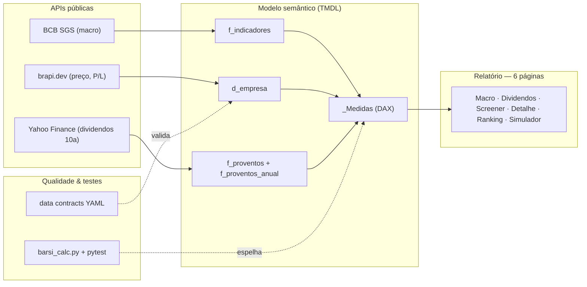

# Panorama Financeiro

[](https://github.com/fabianoamaralbr/pbi_panorama_financeiro/actions/workflows/ci.yml)


> Um dashboard de **Power BI** que cruza o **cenário macro brasileiro** com um **screener de
> ações pagadoras de dividendos** (método Barsi/Bazin) para responder: *dado o juro atual,
> quais ações perenes estão baratas o suficiente para gerar renda passiva — e quão
> consistente é esse histórico?*

Projeto de portfólio em **Power BI (PBIP/TMDL)**, 100% versionado em texto e alimentado por
**APIs públicas** (Banco Central, brapi, Yahoo Finance). Reúne dois domínios num único modelo
semântico:

1. **Macro Brasil (BCB/SGS)** — Selic, CDI, IPCA, IGP-M, câmbio e PIB.
2. **Ações — método Barsi** — dividendos, preço-teto (Bazin), consistência histórica, Score
   composto e simulador de renda passiva, para o universo **BESST** (Bancos, Energia,
   Saneamento, Seguros e Telecom).

📊 **Achados com dados reais (snapshot datado):** **[`INSIGHTS.md`](INSIGHTS.md)** — inclui a
leitura de que, com a Selic a 14%, o yield-alvo padrão de 6% do preço-teto fica conservador,
e o screener das pagadoras BESST abaixo do teto.

## 📸 Prévia

> ⏳ **Screenshots pendentes.** O GitHub não renderiza `.pbip`, então as telas do relatório
> precisam ser exportadas do Power BI Desktop para `docs/img/`. Guia passo a passo e os nomes
> de arquivo esperados em [`docs/img/README.md`](docs/img/README.md). Assim que os PNGs
> estiverem lá, descomente o bloco abaixo:

<!-- Ative quando os PNGs existirem em docs/img/ :
| Cenário Macro | Screener Barsi | Simulador de Renda Passiva |
|---|---|---|
|  |  |  |
-->


## 🎯 O que este projeto demonstra

- **Modelagem dimensional** — star schema com dois domínios no mesmo modelo, tudo em PBIP/TMDL versionado.
- **DAX avançado** — medidas documentadas com padrões corretos (`REMOVEFILTERS`, `DIVIDE`, clamps, `SWITCH(TRUE())`), incluindo o VF de anuidade crescente reinvestida (simulador).
- **Power Query (M)** — ingestão defensiva: janelamento da API do BCB (limite de 10 anos), `try...otherwise`, parsing por cultura.
- **Analytics engineering** — oráculo Python testado (`pytest`) espelhando o DAX como fonte de verdade das fórmulas; **CI** rodando a cada push.
- **Governança & qualidade** — *data contracts* (YAML), validação ao vivo contra as fontes e métricas de observabilidade.
- **Domínio de negócio** — método Barsi/Bazin e a conexão explícita entre **macro** (custo de oportunidade) e **renda variável** (a oportunidade).

## 🏛️ Arquitetura



## Fontes de dados

Todas públicas, sem dados sensíveis.

| Domínio | Fonte | Autenticação |
|---|---|---|
| Macro (séries temporais) | BCB SGS — `https://api.bcb.gov.br/dados/serie/bcdata.sgs.{codigo}/dados?formato=json` | Nenhuma |
| Ações — preço, P/L, setor | [brapi.dev](https://brapi.dev) — `/api/quote/{ticker}` e `/api/quote/list` | Token free |
| Ações — dividendos/JCP | Yahoo Finance — `query1.finance.yahoo.com/v8/finance/chart/{ticker}.SA?range=1y&events=div` | Nenhuma |

### Séries macro (BCB SGS)

| Código | Indicador            | Frequência |
|-------:|----------------------|------------|
| 432    | Selic Meta           | Diária     |
| 12     | CDI                  | Diária     |
| 433    | IPCA (mensal)        | Mensal     |
| 13522  | IPCA (acum. 12m)     | Mensal     |
| 189    | IGP-M (mensal)       | Mensal     |
| 1      | Dólar PTAX (venda)   | Diária     |
| 4380   | PIB mensal           | Mensal     |

## Modelo

Dois conjuntos de tabelas (star schema) no mesmo modelo semântico:

```
Macro:   d_indicador 1 ── * f_indicadores * ── 1 d_calendario
Ações:   d_empresa   1 ── * f_proventos        (chave: ticker)
```

**Macro**
- `d_indicador` — catálogo de séries (código → nome, unidade, tipo).
- `f_indicadores` — fato longo (`data`, `codigo`, `valor`) alimentado pela função M
  `fnBcbSgs`, que fatia séries diárias em janelas de ≤10 anos (limite da API).
- `d_calendario` — tabela de datas gerada em M.

**Ações**
- `d_empresa` — dimensão por ação (`ticker`, `nome`, `setor`, `preco_atual`, `pl`,
  `min_52s`, `max_52s`), montada pela função M `fnBrapiQuote` (uma chamada brapi por
  ticker) com o setor vindo de `/api/quote/list`. *(Obs.: o plano free da brapi não aceita
  múltiplos tickers por chamada — por isso é uma requisição por ticker.)*
- `f_proventos` — fato de dividendos/JCP (`ticker`, `data_pagamento`, `valor`, `tipo`),
  alimentado pela função M `fnYahooProventos` (Yahoo Finance, uma chamada por ticker —
  o endpoint do Yahoo não aceita lote).

`_Medidas` reúne as medidas DAX, organizadas em pastas: base (`Valor Atual`), variações,
estatística, dividendos/ação, **indicadores dedicados** (`Selic Meta`, `IPCA 12m`, `Dólar PTAX`, `PIB Mensal` — cada uma com o filtro
de `codigo` embutido, para não depender de filtro no visual) e **diagnóstico de carga**
(`Tickers Monitorados`, `Tickers sem Preço`, `Cobertura de Preço %`, `Tickers com Proventos`).

## Como usar

1. Abra `Panorama Financeiro.pbip` no Power BI Desktop (versão com suporte a PBIP/TMDL).
2. Ao abrir, defina a privacidade das fontes (`api.bcb.gov.br`, `brapi.dev`,
   `query1.finance.yahoo.com`) como **Público**.
3. Preencha o parâmetro `BrapiToken` (veja abaixo).
4. Clique em **Atualizar** para buscar os dados ao vivo das APIs.

## Parâmetros

| Parâmetro | Padrão | Descrição |
|---|---|---|
| `DataInicial` | `2015-01-01` | Início do histórico das séries macro. |
| `UrlBaseBCB` | `https://api.bcb.gov.br` | Base da API do Banco Central. |
| `UrlBaseBrapi` | `https://brapi.dev` | Base da API brapi. |
| `BrapiToken` | `""` | Token free do brapi (**obrigatório** para preço/P/L/setor das ações). |
| `IbovTickers` | carteira do índice | Lista de tickers (Ibovespa + adicionais monitorados). |

> **Nunca comite o token.** O Power BI Desktop reescreve `BrapiToken` com o valor real
> ao salvar. O arquivo `Panorama Macro BCB.SemanticModel/definition/expressions.tmdl`
> está protegido por **`git skip-worktree`**: o git ignora as reescritas locais do token,
> então o valor real vive apenas no working-tree local e o commit mantém `BrapiToken = ""`.
> Não é mais necessário zerar manualmente antes de cada commit.
>
> - **Config local (não versionada):** em um clone novo/outra máquina, reaplique com
>   `git update-index --skip-worktree "Panorama Macro BCB.SemanticModel/definition/expressions.tmdl"`.
> - **Para commitar mudança legítima nesse arquivo** (funções M, `IbovTickers`):
>   `git update-index --no-skip-worktree <arquivo>` → zere o token para `""` → commite →
>   reative com `git update-index --skip-worktree <arquivo>`.
> - Um `git pull` que altere esse arquivo pode conflitar — desmarque o skip-worktree antes.

### Como obter o token da brapi

O domínio de **ações** depende de um token da [brapi.dev](https://brapi.dev). Ele é
**gratuito** e obrigatório para o projeto puxar preço, P/L e setor das ações. Para gerar:

1. Crie uma conta gratuita em [brapi.dev](https://brapi.dev).
2. Acesse o painel (dashboard) da sua conta e **gere um token**.
3. Cole o valor no parâmetro `BrapiToken` do Power BI Desktop e clique em **Atualizar**.

**O que o token dá acesso** — endpoints `/api/quote/{ticker}` e `/api/quote/list`, que
alimentam a dimensão `d_empresa`:

| Dado | Campo da API brapi |
|---|---|
| Preço atual da ação | `regularMarketPrice` |
| Índice P/L (preço/lucro) | `priceEarnings` |
| Mínimo de 52 semanas | `fiftyTwoWeekLow` |
| Máximo de 52 semanas | `fiftyTwoWeekHigh` |
| Nome da empresa | `longName` / `shortName` |
| Setor | via `/api/quote/list` |

> **O que NÃO precisa do token:** as séries macro (BCB) e os dividendos/JCP (Yahoo Finance)
> são públicos e funcionam sem token. **Sem o token**, a dimensão `d_empresa` fica vazia e a
> página de dividendos perde preço, P/L e setor (o Dividend Yield não é calculado).

## Página "Dividendos (Ibovespa)"

Lista as 15 ações do Ibovespa com maior **Dividend Yield dos últimos 12 meses**, com
setor, preço, P/L e faixa de 52 semanas.

- **DY 12m** = (dividendos + JCP pagos nos últimos 12 meses) ÷ preço atual.
- **Dividendos via Yahoo Finance** (grátis, sem token): o plano free do brapi só expõe
  proventos para tickers de sandbox (PETR4, VALE3, MGLU3, ITUB4), então os dividendos de
  todo o universo vêm do Yahoo. Preço, P/L e setor continuam vindo do brapi.
- **Composição do Ibovespa:** atualize o parâmetro `IbovTickers` a cada rebalanceamento
  trimestral da B3.
- **Top 15:** aplique um filtro **Top N (15) por `Dividend Yield 12m`** nos visuais da
  página (filtro de visual no Desktop). Não use seleção manual de empresas num slicer —
  ela não acompanha a atualização dos dados.

## Método Barsi

A partir da **versão 2.0**, o projeto incorpora uma camada de análise pelo método Barsi —
uma abordagem de seleção de ações pagadoras de dividendos baseada em preço-teto (Bazin),
consistência histórica e score composto.

### Universo monitorado (BESST ampliado)

O parâmetro `IbovTickers` foi ampliado para incluir ~95 tickers: além do Ibovespa, cobre
os cinco setores do acrônimo **BESST** (Bancos, Energia elétrica, Saneamento, Seguros e
Telecom), adicionando pagadoras consistentes fora do índice como ABCB4, SAPR11, WIZC3, ALUP11
e outras. O mapeamento ticker → sigla BESST é curado manualmente em `d_besst` para contornar
a ambiguidade dos setores retornados pela brapi.

### Páginas

| Página | Descrição |
|---|---|
| **Seleção Barsi (Screener)** | Tabela comparativa: Preço, Preço-Teto, Margem vs Teto, Sinal (Comprar/Aguardar), DY 12m, DY Médio 5a, Anos Consecutivos, P/L e Score Barsi. Slicer de Yield Desejado (what-if) e card com contagem de ações abaixo do teto. |
| **Detalhe da Ação** | Histórico de proventos por ano (gráfico de barras), cards de preço atual, preço-teto, margem de segurança, posição na faixa de 52 semanas, anos consecutivos, CAGR de dividendos e P/L. Slicer de ação (seleção única). |
| **Ranking Barsi** | Barras horizontais com as ações rankeadas por Score Barsi. Filtros por sigla BESST e Yield Desejado. |
| **Simulador de Renda Passiva** | Projeção de patrimônio e renda mensal via bola de neve (aportes crescentes + reinvestimento de dividendos). Sliders: aporte mensal, DY esperado, crescimento anual do aporte e horizonte de investimento. Curva de evolução ano a ano. |

### Medidas principais

| Medida | Descrição |
|---|---|
| `Dividendo Médio Anual 5a` | Soma dos proventos dos últimos 5 anos completos ÷ 5 (denominador fixo). |
| `Preço-Teto` | Dividendo Médio Anual 5a ÷ Yield Desejado (Bazin). |
| `Margem vs Teto %` | (Preço-Teto − Preço Atual) ÷ Preço Atual. Positivo = abaixo do teto. |
| `Sinal Barsi` | "Comprar" quando Preço ≤ Preço-Teto; "Aguardar" quando acima; "Sem histórico" quando teto = 0. |
| `Anos Consecutivos` | Maior sequência de anos com pagamento terminando no último ano completo (janela 10a). |
| `Score Barsi` | 0–100 pts. Pesos: DY Médio 30 · Anos Consecutivos 25 · BESST 15 · Margem 20 · P/L 10. |
| `Patrimônio Projetado` | FV de aportes anuais crescentes reinvestidos ao DY esperado (sem ganho de capital). |
| `Renda Passiva Mensal Projetada` | Patrimônio Projetado × DY Esperado ÷ 12. |

### Verificação (oráculo Python)

As fórmulas são implementadas primeiro em Python puro (`scripts/barsi_calc.py`) e testadas
com pytest (`tests/test_barsi_calc.py`). As medidas DAX espelham essas fórmulas — o **CI
(GitHub Actions)** roda a suíte a cada push:

```bash
pip install -r requirements.txt
pytest -q
```

Para checar um cenário do simulador diretamente:

```bash
python -c "
from scripts.barsi_calc import patrimonio_projetado, renda_passiva_mensal
fv = patrimonio_projetado(aporte_mensal=1000, dy=0.06, cresc_aporte=0.05, anos=20)
print(f'Patrimônio: R$ {fv:,.0f}  |  Renda mensal: R$ {renda_passiva_mensal(fv, 0.06):,.0f}')
"
```

## Qualidade de dados

Contratos de dados em `contracts/panorama/` (`macro_indicadores.yml`, `acoes_dividendos.yml`)
definem thresholds de frescor, domínio de valores, cobertura de preço e plausibilidade do
Dividend Yield (0–30%). O validador `scripts/dq_check_panorama.py` checa os dados ao vivo
contra esses contratos e grava relatório/métricas em `outputs/`:

```bash
# BCB e Yahoo são públicos; brapi lê o token do ambiente (nunca hardcoded)
BRAPI_TOKEN=seu_token python scripts/dq_check_panorama.py
python scripts/dq_check_panorama.py          # sem token: pula d_empresa (WARN)
```

Em tempo de relatório, as medidas da pasta **Diagnóstico** sinalizam falhas parciais de
carga (ex.: `Cobertura de Preço %` abaixo de 100% indica tickers sem retorno da brapi).

### Snapshot reproduzível (sem abrir o Power BI)

`scripts/barsi_ranking.py` gera o ranking Barsi e o cenário macro a partir das mesmas APIs,
usando o oráculo `barsi_calc.py` — assim qualquer pessoa vê os resultados sem o Desktop:

```bash
BRAPI_TOKEN=seu_token python scripts/barsi_ranking.py   # ranking completo (com preço/score)
python scripts/barsi_ranking.py                         # sem token: só consistência (Yahoo/BCB)
```

Saídas datadas (Markdown + CSV) em `outputs/insights/`. A leitura interpretada desse
snapshot está em [`INSIGHTS.md`](INSIGHTS.md).

---

Projeto de portfólio; 100% baseado em dados públicos, sem credenciais versionadas.
